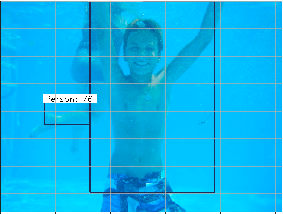

# Object-detection-using-Faster-RCNN
## Introduction

What exactly is object detection?

Looking at the picture below what do you see? Well if everythings loading properly then you're thinking two cute baby penguins. If that's the case then you're 100% correct its two cute baby penguins. What you just did was object detection you identifed that there is an object in the image!

Now the next step would be for me to ask you if you could draw boxes around where the penguins are in the image. If you were to do that it would probably look something like this:

Now what you've just done is object detection! You not only identified that the penguins were in the image you showed me where and how confident you were that it was a penguin. 

## Motivation

Now why is object detection hard for computers to do? Computers unfortunately dont see images as we do. Instead of seeing two cute penguins they see a 3-dimensional array of numbers between 1-255 for each individual square or pixel. An example below. Now that you've seen how a computer sees images suddenly object detection becomes a bit trickier!

You could be asking yourself, why is object-detection useful? A few examples I can think of are things such as self-driving cars or self-flying drones. This is only becoming more relevant as time goes on just earlier this week Tesla released their first full self driving car ride video(https://www.youtube.com/watch?v=tlThdr3O5Qo). Amazon has also been working diligently for the past few years trying to get drones to deliver packages. Now that we have some background lets dive into it.

## The Data
[Google AI Open Dataset](https://storage.googleapis.com/openimages/web/index.html)

Over 1.7 million unique images, 600 different types of classes, and over 14 million human identifed objects within the images.

An example of how the original images look

Because the dataset is so massive I chose a subset of about 2500~ images split them into 1800 train and 700 test this gave me close to 8000 objects to try and detect.

Steps to download the type of data I used

1.) Press *Download*

2.) Then press *Download from Figure Eight*

3.) Next *Download Options* in the top right

4.) Under Train_00.zip download train-annotations-bbox.csv and train-images-boxable.csv

5.) Scroll down the page to the 'Please Note' then click the hyper link in the second paragraph labeled '*You can download it here*'.

## Faster R-CNN

Originally presented in a paper titled [**Faster R-CNN: Towards Real-Time Object Detection
with Region Proposal Networks**](**https://papers.nips.cc/paper/5638-faster-r-cnn-towards-real-time-object-detection-with-region-proposal-networks.pdf). Faster region-based convolutional neural network is the third iteration of the R-CNN family and by far the fastest. 

Now how exactly does it work? 

(Image credit to the [original paper](https://arxiv.org/pdf/1506.01497.pdf))

Lets start at the bottom of the image. First you pass in the full reshaped image to the 'conv layers' these layers are generally a pretrained network such as the VGG-16 or ResNet with the heads cut off 
allowing us to extract just the feature maps generated by these networks. If you're unsure what a feature map is, think of a simplified image where everything but the feature (a line, or a curve, maybe a square, things that help the computer determine what type of object it is) is ignored. 

If you'd like to look further into feature maps heres a link to help to a research paper titled [Visualizing and Understanding Convolutional Networks](https://arxiv.org/pdf/1311.2901.pdf). 

Now that we've extracted the feature maps we then pass them to our Region Proposal Network(RPN). The RPN is the real star of the show, this is what allowed Faster-RCNN to be 250x faster than the original RCNN model. The RPN is actually two neural networks one classification and one regression. The regression network generates by default 9-bounding boxes per pixel on the feature map. These bounding boxes are a 1:1, a 2:1, and a 1:2 ratio with the original proposed size being 128,256,512 pixels. For the purposes of my project I actually reduced the image size to 300 pixels, so I halved those values leaving me with a size 64,128,256 pixels for my boxes. Now that we've proposed our boxes the classifaction network kicks in and determines whether an object is in the proposed region or not. If the network thinks there is an object in the region it's passed off to the RoI pooling layer.

The RoI(Region of Interest) pooling layer extracts the original portion of the image within that bounding box and passes it to another two networks. 

Again one is a regression and one is a classifier, the regression network generates a bounding box for where it thinks the object is in this portion of the image. The classifaction network then based on this region determines what type of object is within that bounding box. Is it a bird? A plane? Superman? Well if the networks well trained lets hope it predicts the correct answer!

Thats a quick summary of how Faster Region-based Convultional Neural Network works. If you have any questions please feel free to get into contact with me!

## My Models

I trained two models, one to detect where a person is. Another to detect traffic lights, birds, and footballs. I trained on a AWS p2.Xlarge instance, which was taking about 6 minutes per epoch or in other words 6 minutes per 1000 images processesed. Both models were trained for around 150 epochs. 

The graphs for the traffic lights, birds, and footballs model.

 

As you can see by the graphs above the models were still learning as the epochs progressed so they definitely could have used more training time.

## Results

Here is some of my favorite results from both models.

 

 

 

## Conclusions 

With only a week to do this project I would say that my models preformed well. But this whole project has been a very fun experience and Faster R-CNN is a very complex model type that works extremely well.

## Future work

### More training time
* Allowing the model to see the images longer will definitely help it learn the shapes better!

### More training data
* More data allows the model to learn the features of the object better allowing it to perform even better!

### Tryout a ResNet instead of VGG-16
* Self explanatory perhaps a different feature map extractor will help it preform better as-well.

## Acknowledgments

Yinghan Xu's article was an absolute must have for this project. 
[Link](https://towardsdatascience.com/faster-r-cnn-object-detection-implemented-by-keras-for-custom-data-from-googles-open-images-125f62b9141a)

Tryo labs wrote an excellent article on Faster-RCNN that helped my understanding tremendously [Link](https://tryolabs.com/blog/2018/01/18/faster-r-cnn-down-the-rabbit-hole-of-modern-object-detection/)

